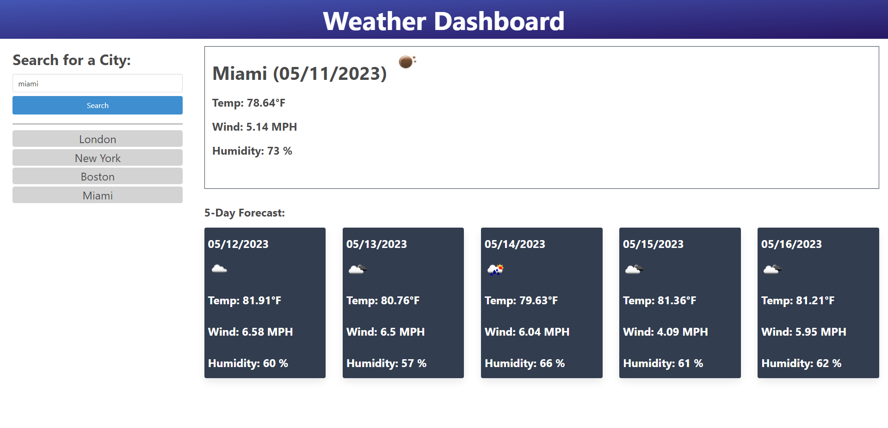

# Weather Dashboard

## Description

This is a simple weather dashboard that allows a user to see the weather outlook for multiple cities.

## Usage

* The users can search the current weather and 5-day forecast by enter the city's name.
* The search history will be saved.
* The users can click on a city in the search history to see the weather conditions of that city again. 

## Links

Page published at https://mtan1230.github.io/weather-dashboard/

## Screenshots

